<!-- Merged with EoD addendum on 2025-10-13. -->


# **Commercial Loan Management System: Full System Specification**

## **Part 1: Executive & Business Overview**

### **1.1. Introduction & System Purpose**

This document provides a comprehensive technical and functional specification for the Commercial Loan Management System (LMS). The system is a specialized software platform designed to de-risk commercial loan servicing through a fully auditable, automated platform that ensures financial accuracy and operational efficiency. Its primary purpose is to serve as the immutable system of record for fixed-term commercial loans post-funding, automating the complex daily calculations, payment processing, and financial bookkeeping required throughout the loan lifecycle.1

The strategic goal of the LMS is to replace manual, error-prone processes with a robust, event-driven system that provides a complete and unchangeable audit trail of every action. This approach guarantees the highest levels of accuracy and traceability, which are critical for financial reporting and regulatory compliance.1 By acting as a detailed sub-ledger, the LMS streamlines the month-end accounting process, preparing clean, aggregated financial summaries for the company's main General Ledger (GL). This significantly reduces the burden on finance teams and enhances the integrity of the company's overall financial data.1

This specification is intended for a diverse audience, including business stakeholders, project managers, software developers, and quality assurance teams.2 For business stakeholders and potential customers, it outlines the system's value proposition and functional capabilities. For the Cyoda AI generation engine, it provides the precise, unambiguous entity models, state transitions, and business rules required to generate the back-end application. For the Lovable.dev front-end development team, it details the user interface (UI) requirements, user experience (UX) principles, and the definitive Application Programming Interface (API) contract required to build an intuitive and effective user interface.

### **1.2. System Scope (In-Scope / Out-of-Scope)**

Defining a clear and explicit scope is critical to ensure a focused development effort for this initial version (Minimum Viable Product \- MVP) and to manage stakeholder expectations.3 The scope has been carefully defined to deliver core value in loan servicing while establishing a strong foundation for future enhancements.

#### **In-Scope Features (MVP)**

The initial release of the LMS will focus exclusively on the servicing of funded, fixed-term commercial loans. The core functional scope includes:

* **Loan Lifecycle Management:** The system will manage the entire post-funding lifecycle of a loan, from the point of funding, through its active servicing period, to its final settlement or scheduled closure.1
* **Daily Interest Accrual:** The system will automatically perform daily interest calculations for all active loans. This calculation will be based on the loan's outstanding principal, its specific annual percentage rate (APR), and pre-configured day-count conventions (e.g., ACT/365, ACT/360).1
* **Payment Processing and Allocation:** The system will ingest and process borrower payments. It will implement a strict allocation waterfall, applying funds first to any accrued interest, then to fees (if applicable), and finally to the loan's principal balance.1
* **Early Settlement Quotation:** The system will provide the functionality to calculate and generate early settlement quotes for borrowers who wish to repay their loan ahead of the scheduled maturity date.1
* **Month-End Accounting Summaries:** At the conclusion of each accounting period, the system will aggregate all financial activities (accruals, payments, etc.) into a summarized batch, ready for export to the downstream General Ledger system.1

#### **Out-of-Scope (Future Roadmap / Potential Enhancements)**

The following areas are explicitly out of scope for the MVP. Framing these as part of a future roadmap, rather than as limitations, demonstrates a strategic and disciplined approach to product development. It shows a clear vision for the platform's evolution and its potential for future growth and customization.

* **Loan Origination and Underwriting:** The system will not handle any pre-funding activities, such as loan application processing, credit scoring, risk assessment, or underwriting decisions. It assumes a loan is fully approved and ready for funding when it enters the LMS.1
* **Complex Loan Products:** The MVP will be limited to simple, fixed-term commercial loans. More complex financial products, such as those with variable interest rates, revolving lines of credit, or syndicated loans, are not included.1
* **Delinquency and Collections Management:** The system will not include workflows for managing late payments, delinquency tracking, collections, or workout arrangements. These processes are considered separate functional domains for future consideration.1
* **Direct Customer-Facing Portal:** The UI is designed for internal operational staff. A self-service portal for borrowers is out of scope for this version.


### **1.2A. Scope Extension — Events of Default (MVP‑EoD)**

**Purpose:** Introduce a minimal, auditable process to **detect**, **record**, **triage**, **cure**, and **(optionally) accelerate** loans following an Event of Default (EoD), while keeping full collections & enforcement outside MVP.

**In‑Scope (MVP‑EoD)**
- **EoD Catalog (configurable):**
    - *Non‑payment beyond grace period*
    - *Breach of covenant* (manual raise or external feed)
    - *Cross‑default* (manual/external)
    - *Insolvency/bankruptcy* (manual/external)
    - *Misrepresentation* (manual)
- **Case lifecycle:** Open → In‑Cure → Cured / Confirmed → Accelerated (optional) → Closed.
- **Cure handling:** Record cure actions and outcomes; restore standard terms on cure.
- **Default interest option:** Optional switch to a **default rate** (APR + configurable default margin) while default persists.
- **Acceleration option:** Compute **accelerated payoff** and freeze further schedule‑based processing for the loan.
- **Accounting options (policy controlled):**
    - Continue accrual at default rate **or**
    - Suspend income recognition (non‑accrual) and track memo interest.
- **Audit & controls:** Maker/Checker on **Confirm Default** and **Acceleration**; immutable timeline.

**Out‑of‑Scope (remains future):** Full collections strategies, legal enforcement workflow, collateral realization.

> Rationale: This extension complements the existing post‑funding servicing scope by adding controlled exception handling without introducing full collections or borrower‑facing tools.

### **1.3. User Personas and Roles**

To ensure the system is designed with a deep understanding of its end-users, we define the following user personas. This practice moves beyond abstract role titles to create empathetic, character-based representations of the primary users, detailing their goals, responsibilities, and the problems the LMS solves for them.4 Grounding functional requirements in these personas ensures the development process remains user-focused and delivers tangible value.5

The system is designed for use by internal operational staff who fulfill specific roles within the loan servicing process.1

| Persona Name & Role | Key Responsibilities | Goals & Motivations | Pain Points Solved by LMS |
| :---- | :---- | :---- | :---- |
| **Clare, the Loan Administrator** | Onboarding new loans, managing the approval workflow, funding loans, and viewing detailed loan statuses and schedules. | To ensure 100% data accuracy from the moment a loan is onboarded. To maintain a single, reliable source of truth for all loan data, eliminating discrepancies. To process new loans efficiently to meet departmental Service Level Agreements (SLAs). | Reduces the risk of manual data entry and calculation errors during loan setup. Eliminates time wasted reconciling data across multiple spreadsheets or legacy systems. Provides instant access to a loan's complete history and current status. |
| **Peter, the Payment Processor** | Manually entering individual borrower payments, managing the import of batch payment files (e.g., from bank statements), and ensuring payments are correctly matched to their corresponding loans. | To process all daily payments with speed and accuracy. To quickly identify and resolve any unmatched or exceptional payments. To ensure the company's cash position is accurately reflected in the system. | Automates the matching of payments to loans, reducing manual effort. Provides a clear workflow for handling exceptions. Ensures a clear audit trail for every payment received and allocated. |
| **Fiona, the Finance Manager** | Overseeing the month-end closing process, reviewing the aggregated financial summaries generated by the LMS, ensuring the GL batch is balanced and accurate, and managing the export to the main accounting system. | To achieve a faster, more reliable month-end close. To have high confidence in the financial data being posted to the General Ledger. To easily access detailed sub-ledger data to answer audit or management queries. | Replaces a manual, time-consuming aggregation process with an automated one. Provides control totals and validation checks to ensure the GL batch is accurate before export. Enforces a maker/checker workflow for critical financial controls. |

### **1.4. System Architecture & Context Diagram**

The Loan Management System is built upon a modern, event-driven architecture. This architectural choice is fundamental to its design, ensuring that every action taken on a loan is captured as an immutable event. This creates a complete and verifiable audit trail, which is the cornerstone of the system's reliability and compliance capabilities.1 At a high level, the system functions as a self-contained service responsible for the loan servicing sub-domain.

To provide an unambiguous visual representation of the system's boundaries and its interactions with users and other systems, the following System Context Diagram is provided.5 This diagram offers a clear, high-level overview of the LMS ecosystem, making it easier for all stakeholders to understand its place within the broader enterprise architecture.

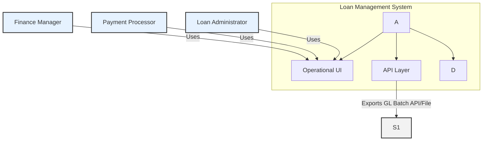

**Diagram Components:**

* **Loan Management System (LMS):** The central system described in this specification. It contains the core business logic, the user interface, the API layer for integrations, and its internal sub-ledger database.
* **Users (Loan Administrator, Payment Processor, Finance Manager):** The internal user personas who interact with the system via its Operational UI to perform their job functions.
* **General Ledger (GL) System:** The primary downstream system. The LMS integrates with the GL by exporting a summarized batch of financial data at the end of each month, acting as a detailed sub-ledger.1

### **1.5. Glossary of Terms & Acronyms**

To ensure clarity and prevent ambiguity, this section defines key domain-specific terms and acronyms used throughout the specification. Establishing a common vocabulary is a critical practice for reducing the risk of misinterpretation by technical and non-technical stakeholders alike.2

| Term / Acronym | Definition |
| :---- | :---- |
| **Accrual** | The process of recognizing interest income as it is earned over time, regardless of when the cash payment is received. In this system, it refers to the daily calculation of interest on a loan's outstanding principal. |
| **Allocation** | The process of applying a received payment to the different components of a borrower's debt, following a specific order of priority (e.g., interest first, then fees, then principal). |
| **Annual Percentage Rate (APR)** | The annual rate of interest charged to borrowers. For the MVP, this is a fixed rate. |
| **Day-Count Basis / Convention** | The specific method used to calculate the fraction of a year for interest calculations. Common conventions include ACT/365 (Actual/365), ACT/360 (Actual/360), and 30/360. |
| **End of Day (EOD)** | A defined daily cut-off time, after which daily processing, such as interest accrual, is initiated. |
| **Entity** | In the context of the Cyoda platform, a core business object (e.g., a Loan, a Payment) that has its own data, lifecycle (states), and associated behaviors. |
| **Event-Driven Architecture** | A software architecture paradigm that promotes the production, detection, consumption of, and reaction to events. In the LMS, every significant action is an event, creating an immutable log. |
| **Finite State Machine (FSM)** | A mathematical model of computation used to design systems. In the LMS, entities with lifecycles (like a Loan) are modeled as FSMs, with defined states and transitions. |
| **General Ledger (GL)** | The central accounting system of the company. The LMS acts as a sub-ledger to the GL. |
| **GL Batch** | A collection of summarized journal entries prepared by the LMS at the end of an accounting period for export and posting to the General Ledger. |
| **Lifecycle** | The sequence of states an entity progresses through from its creation to its termination (e.g., a Loan's lifecycle is Draft \-\> Approved \-\> Active \-\> Closed). |
| **Loan Management System (LMS)** | The software system described in this document. |
| **Minimum Viable Product (MVP)** | The initial version of the system with a focused set of features designed to deliver core value and gather feedback for future development. |
| **Principal** | The amount of money borrowed, or the amount still owed on a loan, separate from interest. |
| **Processor** | In the context of the Cyoda platform, a piece of business logic that is executed when an entity transitions from one state to another. |
| **Sub-ledger** | A detailed ledger that sits below the General Ledger. The LMS serves as the sub-ledger for loan transactions, recording daily details and providing summarized totals to the GL. |
| **Value Date** | The date on which a financial transaction is considered to have occurred and is effective for accounting purposes (e.g., the date a payment is credited). |

## **Part 2: Functional Requirements & System Behavior**

This section translates the system's high-level features into detailed, user-centric functional requirements. By employing the structure of Epics and User Stories, the focus shifts from simply listing what the system does to explaining *who* benefits from a feature and *why* it is valuable.8 This approach fosters a shared understanding among stakeholders, developers, and testers, and ensures that every feature is directly tied to a user need. Each user story is accompanied by specific, testable acceptance criteria, which form the basis for quality assurance and define what "done" means for each piece of functionality.4

### **2.1. Epic & User Story Breakdown**

Functional requirements are organized into Epics, which represent large areas of functionality. These are then broken down into smaller, more manageable User Stories that can be implemented within a single development sprint.6

#### **2.1.1. Epic: Loan Lifecycle Management**

This epic covers all functionalities related to the creation, approval, funding, and closing of a commercial loan.

**User Story 1: Loan Creation**

* **As a** Clare, the Loan Administrator,
* **I want to** create a new loan record by entering its core attributes (e.g., associated party, principal amount, APR, term, funding date).
* **So that** the loan can be formally captured in the system and submitted for the required internal approval.
* **Acceptance Criteria:**
    1. Given I am logged in as a Loan Administrator and navigate to the "Create New Loan" page,  
       When I select a valid Party from the party list,  
       And I enter valid data for Principal, APR, Term (12, 24, or 36 months), and a future Funding Date,  
       And I click "Submit for Approval",  
       Then the system shall create a new Loan entity in the APPROVAL\_PENDING state.
    2. Given I am creating a new loan,  
       When I attempt to submit the form with a missing required field (e.g., Principal),  
       Then the system shall display a validation error message and prevent the creation of the loan.
    3. Given I am creating a new loan,  
       When I enter an APR outside of a pre-configured acceptable range (e.g., less than 1% or greater than 25%),  
       Then the system shall display a warning message, but still allow submission if I confirm the action.

**User Story 2: Loan Approval**

* **As a** Fiona, the Finance Manager (acting as an approver),
* **I want to** review a loan pending approval and either approve or reject it.
* **So that** I can enforce the company's "maker/checker" financial control policy.
* **Acceptance Criteria:**
    1. Given a loan exists in the APPROVAL\_PENDING state,  
       When I, as a user with approval permissions, view the loan details,  
       And I click the "Approve" button,  
       Then the system shall transition the loan's state to APPROVED.
    2. Given a loan exists in the APPROVAL\_PENDING state,  
       When I, as a user with approval permissions, click the "Reject" button,  
       Then the system shall transition the loan's state to a REJECTED state (or back to DRAFT with a reason).
    3. Given I am the user who created the loan (the "maker"),  
       When I view the loan in the APPROVAL\_PENDING state,  
       Then the "Approve" and "Reject" buttons shall be disabled to enforce the maker/checker rule.

**User Story 3: Loan Funding**

* **As a** Clare, the Loan Administrator,
* **I want to** mark an approved loan as "Funded".
* **So that** the system can initialize its financial balances and begin the active servicing lifecycle.
* **Acceptance Criteria:**
    1. Given a loan exists in the APPROVED state,  
       When I navigate to the loan's detail page and click "Confirm Funding",  
       Then the system shall transition the loan's state to FUNDED.
    2. Given a loan has just transitioned to the FUNDED state,  
       Then the system shall set the outstandingPrincipal balance equal to the initial principal amount.
    3. Given the current date is on or after the loan's fundedDate,  
       When the loan is in the FUNDED state,  
       Then the system shall automatically transition the loan's state to ACTIVE.

#### **2.1.2. Epic: Payment Processing**

This epic covers all functionalities related to receiving and allocating borrower payments.

**User Story 4: Manual Payment Entry**

* **As a** Peter, the Payment Processor,
* **I want to** manually record a payment received from a borrower against a specific loan.
* **So that** the funds can be accurately captured and allocated to the borrower's outstanding balance.
* **Acceptance Criteria:**
    1. Given I am viewing an ACTIVE loan,
       When I use the "Record Payment" action and enter a payment amount and a value date,
       And I click "Submit",
       Then the system shall create a new Payment entity in the CAPTURED state, associated with the correct loan.
    2. Given a new payment has been CAPTURED,
       Then the system shall automatically evaluate if the payment matches to an active loan:
        - If the loan exists and is active, the payment transitions to MATCHED.
        - If the loan does not exist or is not active, the payment transitions to UNMATCHED for manual resolution.
    3. Given a payment is MATCHED,
       Then the system shall automatically allocate the funds (interest first, then principal) and transition it to ALLOCATED.
    4. Given a payment is ALLOCATED,
       Then the system shall post the sub-ledger entries, update the loan's balances, and transition the payment to POSTED.
    5. Given a payment is UNMATCHED,
       Then a user can manually match it to a loan or return the payment to the payer.

**User Story 5: View Payment History**

* **As a** Clare, the Loan Administrator,
* **I want to** view a complete history of all payments made against a loan.
* **So that** I can answer queries from borrowers or internal stakeholders about payment application.
* **Acceptance Criteria:**
    1. Given I am viewing any loan that has received payments,  
       When I navigate to the "Payment History" tab,  
       Then I shall see a table listing all associated payments.
    2. Given I am viewing the payment history table,  
       Then the table shall include columns for Payment Date, Value Date, Amount, and Status (e.g., POSTED).
    3. Given I click on a specific payment in the history table,  
       Then I shall be shown a detailed view of that payment, including how the funds were allocated between interest and principal.

#### **2.1.3. Epic: Financial Calculations & Reporting**

This epic covers the core automated financial processes of the system.

**User Story 6: Daily Interest Accrual**

* **As a** System,
* **I want to** automatically calculate and record interest for every ACTIVE loan each day.
* **So that** the company's interest receivable balance is always accurate and up-to-date.
* **Acceptance Criteria:**
    1. Given it is the end of the business day (EOD),  
       When the daily accrual job runs,  
       Then the system shall create one new Accrual record for each loan in the ACTIVE state.
    2. Given an Accrual record is being created for a loan,  
       Then the interest amount shall be calculated as: outstandingPrincipal \* APR \* (Day Count Fraction).
    3. Given the Accrual record is successfully created and recorded,  
       Then the system shall update the accruedInterest balance on the corresponding Loan entity.
    4. Given the accrual job runs,  
       Then it shall post the corresponding debit/credit entries to the internal sub-ledger (Dr Interest Receivable, Cr Interest Income).

**User Story 7: Month-End GL Batch Generation**

* **As a** Fiona, the Finance Manager,
* **I want to** initiate the month-end process to generate a summarized GL batch of all financial activity.
* **So that** I can prepare the financial data for posting to the company's main General Ledger.
* **Acceptance Criteria:**
    1. Given it is the end of an accounting month,  
       When I trigger the "Prepare GL Batch" process for that month,  
       Then the system shall create a new GLBatch entity in the PREPARED state.
    2. Given the GLBatch is PREPARED,  
       Then it shall contain aggregated journal lines summarizing all interest accruals, payment applications, and principal reductions that occurred during the month.
    3. Given the GLBatch is PREPARED,  
       Then the sum of all debit entries must equal the sum of all credit entries.
    4. Given I have reviewed the PREPARED batch and it is correct,  
       When I (and a second approver) execute the "Export" action,  
       Then the system shall generate the GL data in the specified file format (e.g., CSV) and transition the batch to EXPORTED.


#### **2.1.x. Epic: Events of Default Management**

**Actors**
- **Loan Administrator** (maker)
- **Finance Manager** (checker/approver for default & acceleration)
- **Risk/Collections Analyst** (triage, cure tracking)
- **System (Scheduler)** (non‑payment detection)

**User Story E1: Detect Non‑Payment EoD (Scheduled)**

- **As the** System,
- **I want to** scan active loans for missed payments beyond a **product‑level grace period**,
- **So that** I can raise a **Non‑Payment** EoD and open a case.

**Acceptance Criteria**
1. Given a loan is **ACTIVE** and an instalment due date + graceDays has passed with unpaid *required* amount, the system **creates an EoD event** (type: NON_PAYMENT) and **opens a DefaultCase in OPEN** with `cureDeadline = dueDate + graceDays`.
2. The loan’s **dashboard** displays an **EoD banner** with status **IN_CURE** and a countdown to `cureDeadline`.
3. The event and case are written to the audit timeline.

**User Story E2: Manually Raise EoD (Covenant, Cross‑Default, Insolvency)**

- **As a** Risk/Collections Analyst,
- **I want to** raise an EoD with evidence and a recommended cure period,
- **So that** the loan can be triaged with proper controls.

**Acceptance Criteria**
1. From the loan detail, **Raise EoD** allows selection of: COVENANT_BREACH, CROSS_DEFAULT, INSOLVENCY, MISREPRESENTATION.
2. On submit, a **DefaultCase** is opened with state **OPEN** and the **EoD event** is logged as **RAISED**.
3. A **maker/checker** approval is required to **confirm** the EoD (transition **OPEN → CONFIRMED**) before any accounting or rate changes.

**User Story E3: Cure an EoD**

- **As a** Loan Administrator,
- **I want to** record cure actions (e.g., payment receipt, covenant documentation),
- **So that** the case can be **CURED** within the cure window.

**Acceptance Criteria**
1. If cure evidence is accepted by a checker, the DefaultCase transitions **IN_CURE → CURED**, and any **default rate** is removed for periods **after** the cure effective date.
2. The loan **remains ACTIVE**; schedule is recalculated only if the cure involved **payment re‑casting**.

**User Story E4: Confirm Default (Post‑Cure Failure)**

- **As a** Finance Manager (checker),
- **I want to** confirm default when cure window lapses without remedy,
- **So that** default treatments are consistently applied.

**Acceptance Criteria**
1. On `now() > cureDeadline` with outstanding breach, the case becomes **CONFIRMABLE**; checker approval moves it to **CONFIRMED**.
2. On confirm, system applies **policy**:
    - **Option A (Default Rate):** Switch loan to `aprDefault = apr + defaultMarginBps`.
    - **Option B (Non‑Accrual):** Stop income recognition; continue memo accrual.
3. The system records the policy applied and effective timestamp.

**User Story E5: Acceleration (Optional)**

- **As a** Finance Manager (checker),
- **I want to** accelerate the loan,
- **So that** the **accelerated payoff** is calculated and the loan ceases scheduled amortization.

**Acceptance Criteria**
1. When a case is **CONFIRMED**, action **Accelerate** is enabled (checker only).
2. **Accelerate** runs **ComputeAcceleratedBalance**:  
   `principalOutstanding + accruedInterest(to accelDate [+ default interest if policy A]) + fees/charges`
3. Loan state moves to **ACCELERATED**; future schedule items are **suspended**; payment waterfall applies to **accelerated payoff** first.
4. A **SettlementQuote** (reason: ACCELERATION) is created and attached to the case.

**User Story E6: Close Default Case**

- **As a** Risk/Collections Analyst,
- **I want to** close the default case after settlement or waiver,
- **So that** the loan returns to steady‑state tracking.

**Acceptance Criteria**
1. If **accelerated payoff** is fully paid, loan transitions **ACCELERATED → SETTLED** and **DefaultCase → CLOSED**.
2. If **waiver** is approved, case transitions to **CLOSED**, the loan resumes standard terms; any default margin ends from waiver effective date.

### **2.2. Core Business Processes (BPMN Diagrams)**

While user stories are effective for capturing discrete requirements, Business Process Model and Notation (BPMN) diagrams provide a clearer, end-to-end view of complex workflows involving multiple actors and system steps. These diagrams serve as a crucial bridge between the business requirements and the technical implementation, ensuring the system's logic accurately reflects the operational reality.

#### **BPMN: Month-End GL Closing Process**

This diagram illustrates the workflow for generating and exporting the monthly GL batch, showing the interaction between the system's automated tasks and the manual actions performed by the Finance Manager.

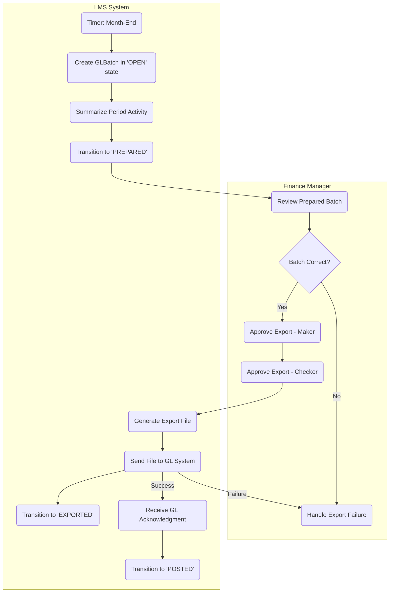


#### **BPMN: EoD Detection & Response (High‑Level)**

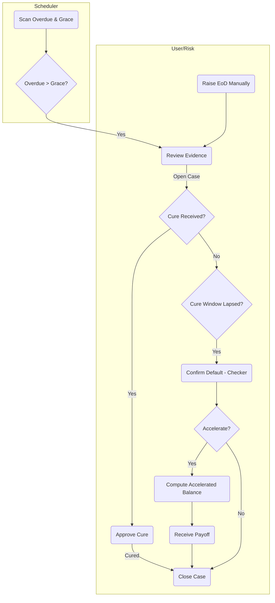

### **2.3. Detailed Feature Specifications & Business Rules**

This section contains the precise, non-negotiable business logic and calculation rules that underpin the system's functionality. Isolating these rules from the user stories and workflows improves clarity and makes the specification more maintainable, as these core financial rules can be updated in one place without altering the broader process descriptions.1

#### **Daily Interest Accrual Calculation**

* **Scope:** This process applies to all loans in the ACTIVE state.
* **Timing:** The process runs once per calendar day, triggered by an EOD event (e.g., post 23:00 Europe/London time).
* Calculation Formula: The daily interest amount is calculated as:  
  interestt​=principalBase×effectiveRate×dcf
    * principalBase: The outstandingPrincipal of the loan at the start of day t.
    * effectiveRate: The loan's fixed APR.
    * dcf (Day-Count Fraction): The fraction of the year represented by a single day, determined by the loan's day-count basis:
        * **ACT/365:** The fraction is . The calculation is leap-year aware.
        * **ACT/360:** The fraction is .
        * **30/360:** Calculated according to the 30/360 day-count convention.
* **Precision:** All interest calculations must be performed and stored internally to a precision of at least 8 decimal places. Values presented in the UI or reports will be rounded to 2 decimal places.
* **Sub-Ledger Posting:** For each daily accrual, the system must generate the following balanced journal entry in its internal sub-ledger:
    * **Debit:** Interest Receivable
    * **Credit:** Interest Income

#### **Payment Allocation Waterfall**

* **Rule:** When a payment is posted, the funds must be allocated in a strict, predefined order.
* **Allocation Order:**
    1. **Accrued Interest:** The payment amount is first applied to the accruedInterest balance on the loan until it is reduced to zero.
    2. **Fees:** (Out of scope for MVP, but the logic should accommodate this placeholder). The remaining amount is applied to any outstanding fees.
    3. **Principal:** Any remaining amount after clearing interest and fees is applied to the outstandingPrincipal balance.
* **Sub-Ledger Posting:** Upon posting a payment, the system generates a multi-line journal entry:
    * **Debit:** Cash (for the total payment amount)
    * **Credit:** Interest Receivable (for the portion allocated to interest)
    * **Credit:** Loan Principal (for the portion allocated to principal)


#### **Default Handling — Business Rules (Additions)**

**2.3.1. Grace & Cure**
- **graceDays**: per product or per loan; applied to *Non‑Payment*.
- **cureDeadline**: `triggerDate + cureDays` (per event type/config).
- Cure transitions revert **default rate** from the **cure effective date** onward.

**2.3.2. Default Interest Policy (Config, per product)**
- `defaultMarginBps`: integer; applied **on and after** `defaultConfirmedAt`.
- **Policy A (Default Rate):** continue accrual → post **Interest Receivable / Default Interest Income**.
- **Policy B (Non‑Accrual):** cease income recognition; accrue to **Suspended Interest (memo)**; cash receipts first clear **suspended**.

**2.3.3. Acceleration**
- **Accelerated Balance** on `accelDate` = `principalOutstanding + accruedRegular + accruedDefault + fees/charges`.
- After acceleration, **no new schedule instalments** are generated; waterfall targets **accelerated balance**.

**2.3.4. Payment Waterfall (While Default Active)**
1) **Default Interest (if Policy A)** → 2) **Regular Accrued Interest** → 3) **Fees/Charges** → 4) **Principal / Accelerated Balance**.

**2.3.5. GL Posting Variants (Policy‑Driven)**
- **Default Rate (A):**
    - Daily accrual: Dr **Interest Receivable (Default)** / Cr **Default Interest Income**
- **Non‑Accrual (B):**
    - No P&L recognition; track memo interest (off‑ledger) until cash is received.
    - On cash receipt: Dr **Cash**, Cr **Suspended Interest** (to reduce memo), remainder Cr **Principal** / **Fees** as applicable.


### **2.4. Accounting Integration Notes (Month‑End) — Default Handling**

- Tag accrual and cash journals arising **while default is active** with source flags (`source = "DEFAULT_INTEREST"` or `source = "SUSPENDED_INTEREST"`) to support **segmented aggregation** in the GL batch.
- The **GLBatch** summarization must respect policy:
    - **Default Rate:** include Default Interest Income lines.
    - **Non‑Accrual:** exclude memo interest from GL; include cash releases reducing Suspended Interest when received.

## **Part 3: Data Model & State Management (Cyoda AI Specification)**

This section provides the formal, technical blueprint of the system's data structures and behavioral models. It is designed to be a direct and unambiguous input for the Cyoda AI generation engine. The content herein defines the core entities, their relationships, attributes, and the precise mechanics of their state-driven lifecycles.

### **3.1. Entity Relationship Diagram (ERD)**

The Entity Relationship Diagram (ERD) below provides a visual, canonical representation of the system's data architecture. It illustrates the primary data entities and the relationships between them, serving as the foundational blueprint for the database schema and the generated application code.10

### **3.1.1 Entities**

Loan: This is the central entity, or "aggregate root," that represents a single commercial loan. It holds key information like the principal amount, term, APR, and current status
Party: This entity represents the borrower legalEntity of the loan. The Loan entity links to it via a party\_id3.

Accrual: This entity records the result of the daily interest calculation for each active loan.

Payment: This represents a single payment received from a borrower and details how the funds were allocated to interest, fees, and principal.

SettlementQuote: This entity stores the details of a quote for an early loan settlement, including the total amount due and the quote's expiration date.

GLBatch: A batch of summarized accounting entries prepared at the end of a month for posting to the General Ledger. It includes header information, control totals, and an embedded list of GL lines as a sub-structure within the entity.

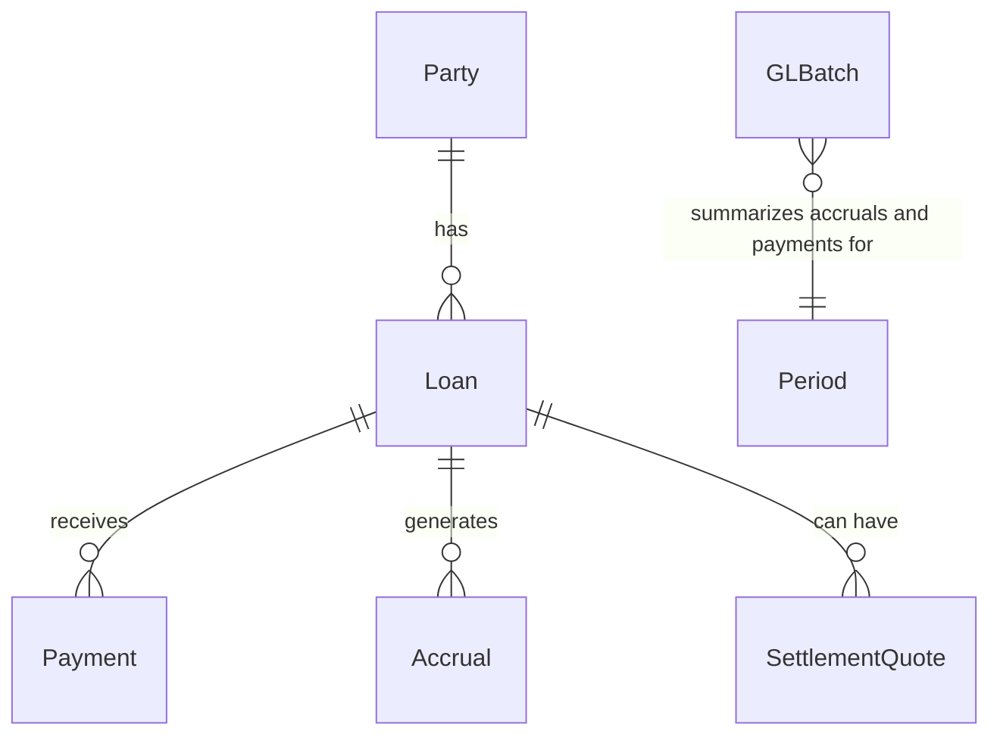


### **3.1A. ERD (Delta for Default Handling)**

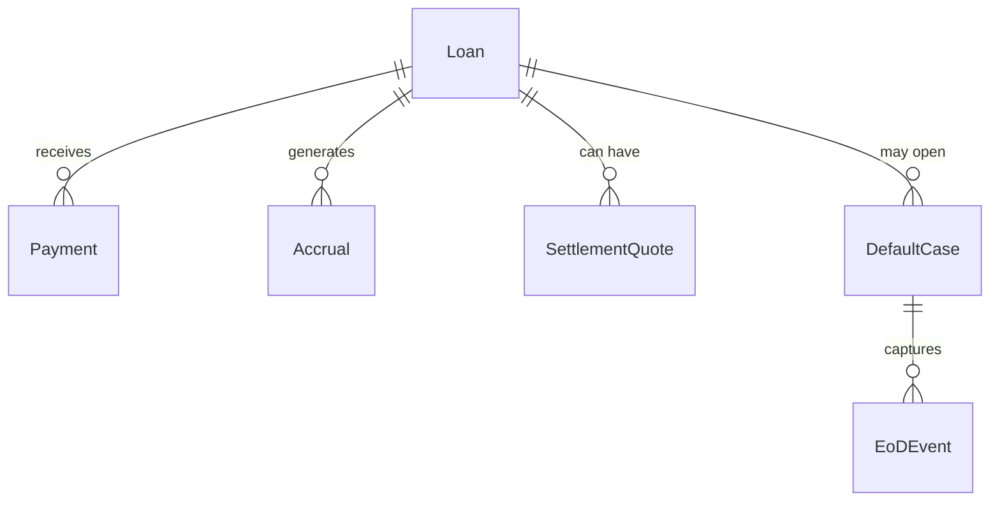

### **3.1.2. New Entities (Conceptual)**

**EoDEvent** — Captures a single alleged or confirmed event of default against a loan.

| Field | Type | Notes |
|---|---|---|
| eodEventId | string | Identifier |
| loanId | string | FK Loan |
| type | enum | NON_PAYMENT \| COVENANT_BREACH \| CROSS_DEFAULT \| INSOLVENCY \| MISREPRESENTATION |
| raisedAt | datetime | When raised |
| source | enum | SYSTEM \| USER \| EXTERNAL |
| graceDays | int | For non‑payment or as configured |
| cureDays | int | Optional |
| status | enum | RAISED \| IN_CURE \| CURED \| CONFIRMED \| WITHDRAWN |
| evidence | array | URIs/notes |
| audit | object | Created/updated info |

**DefaultCase** — Aggregates EoD events and drives consequential actions.

| Field | Type | Notes |
|---|---|---|
| defaultCaseId | string | Identifier |
| loanId | string | FK Loan |
| state | enum | OPEN \| IN_CURE \| CURED \| CONFIRMED \| ACCELERATED \| CLOSED |
| controllingEventId | string | EoDEvent currently controlling the case |
| policy | enum | DEFAULT_RATE \| NON_ACCRUAL |
| defaultMarginBps | int | If policy is DEFAULT_RATE |
| cureDeadline | datetime | Derived from controlling event |
| acceleration | object | { acceleratedAmount, accelDate, quoteId } |
| timeline | array | Case notes & actions |
| audit | object | Maker/Checker approvals |

### **3.3.x. FSMs for Default Handling**

**EoDEvent FSM**

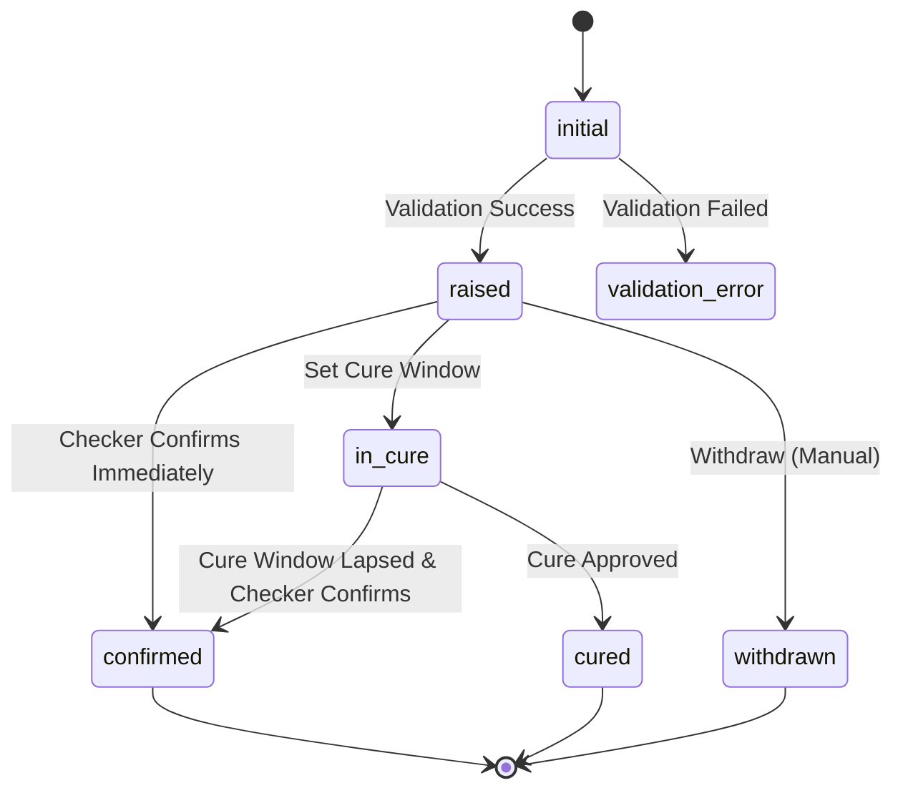

**DefaultCase FSM**

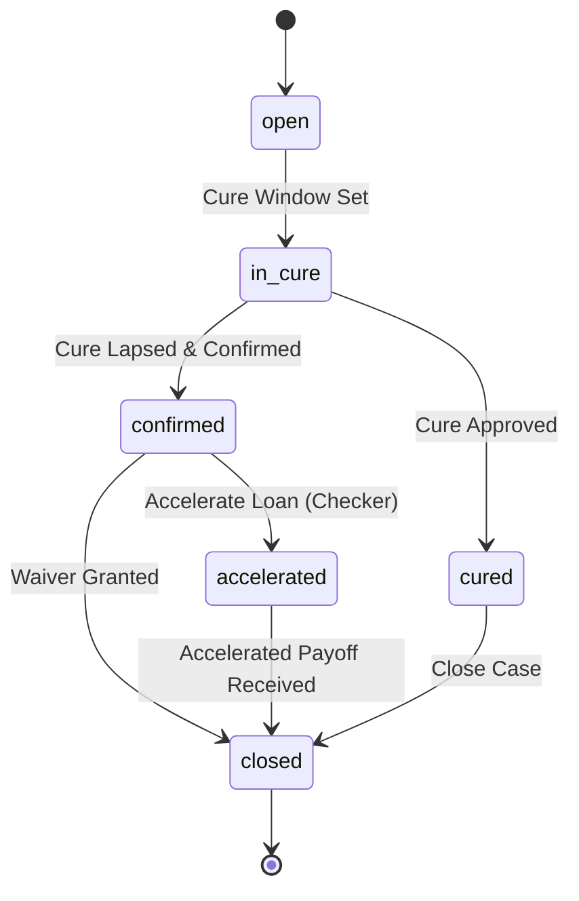

### **3.2. Standard Validation Error Pattern**

All entities in the LMS implement a standard validation error pattern at the start of their lifecycle. This pattern ensures that invalid entities are caught early, validation errors are clearly communicated, and users have a clear path to correct and retry.

#### **Pattern Structure**

Every entity workflow begins with an `initial` state that has two possible transitions:

1. **Success Path**: If the entity passes validation, it transitions to its first operational state (e.g., DRAFT for Loan, ACTIVE for Party, CAPTURED for Payment)
2. **Error Path**: If the entity fails validation, it transitions to a `validation_error` state where the error details are attached to the entity

#### **Components**

* **{Entity}ValidationCriterion**: Returns `true` if the entity data is valid
* **{Entity}ValidationFailedCriterion**: Returns `true` if the entity data is invalid (inverse of validation criterion)
* **Attach{Entity}ValidationErrorProcessor**: Populates the `validationErrorReason` field with detailed error information
* **ClearValidationErrorReasonProcessor**: Clears the error field (shared across all entities)

#### **Recovery Mechanism**

From the `validation_error` state, users can manually trigger a `FIX` transition that:

1. Clears the `validationErrorReason` field
2. Returns the entity to the `initial` state
3. Allows the user to correct the entity data and retry the validation

#### **Benefits**

* **Audit Trail**: Every validation failure is recorded with detailed error information
* **User-Friendly**: Clear error messages guide users to fix issues
* **Data Quality**: Prevents invalid entities from entering the main lifecycle
* **Consistency**: Same pattern across all entities reduces cognitive load

#### **Example (Loan Entity)**

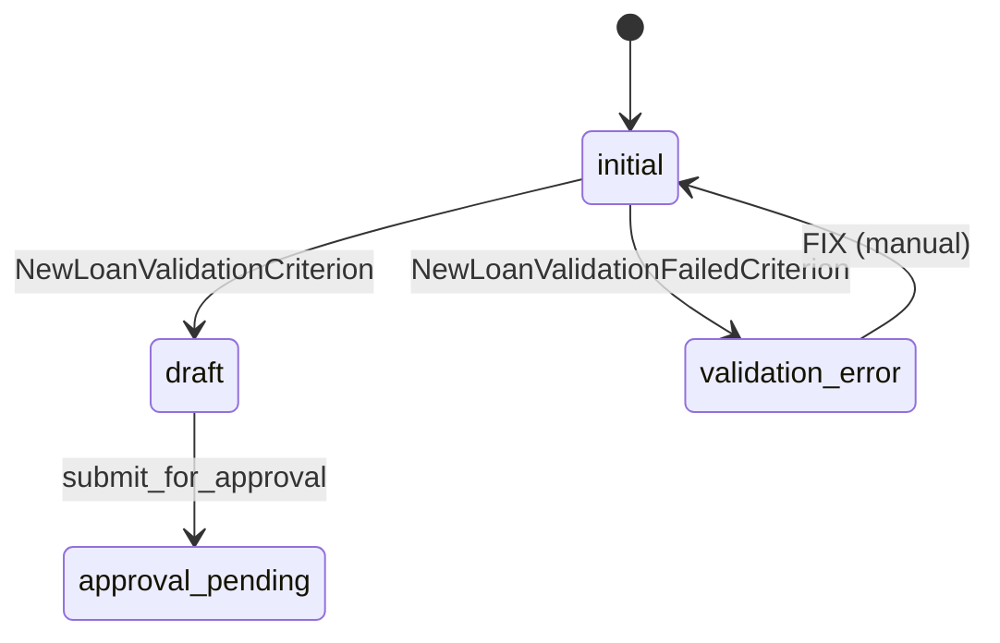

This pattern must be preserved in all entity workflows.

### **3.3. Entity Specifications & State Machine Models**

Each core business object is modeled as an Entity with a structured set of attributes and, for those with a dynamic lifecycle, a formal Finite State Machine (FSM). This entity-centric approach is central to the Cyoda platform's architecture.1

#### **3.3.1. Loan Entity**

Represents a funded commercial loan under servicing. It is the aggregate root for most financial activities.

**NOTE:** The following extended example represents a future-state comprehensive loan structure that includes legal, compliance, and document management features beyond the current MVP scope. See section 3.3.1.1 for the actual MVP implementation.

##### **3.3.1.0. Extended Loan Structure (Future State)**

```json
{
  "loan_id": "LOAN-2025-001",
  "agreement_id": "AG-2025-001",
  "version": 1,
  "effective_date": "2025-01-15",
  "maturity_date": "2030-01-15",
  "governing_law": "England and Wales",
  "purpose": "General corporate purposes",
  "parties": [
    {
      "party_id": "BORR1",
      "name": "Example Borrower Ltd",
      "lei": "5493001KJTIIGC8Y1R12",
      "role": "Borrower",
      "jurisdiction": "GB",
      "commitment_amount": null,
      "commitment_currency": null
    },
    {
      "party_id": "LEND1",
      "name": "Example Bank plc",
      "lei": "549300ABCDEFGHJKLMN1",
      "role": "Lender",
      "jurisdiction": "GB",
      "commitment_amount": 15000000,
      "commitment_currency": "GBP"
    },
    {
      "party_id": "AGENT1",
      "name": "Agent Bank plc",
      "lei": null,
      "role": "Agent",
      "jurisdiction": "GB",
      "commitment_amount": null,
      "commitment_currency": null
    },
    {
      "party_id": "SEC1",
      "name": "Security Trustee Ltd",
      "lei": null,
      "role": "Security Trustee",
      "jurisdiction": "GB",
      "commitment_amount": null,
      "commitment_currency": null
    }
  ],
  "facilities": [
    {
      "facility_id": "FAC1",
      "type": "Revolver",
      "currency": "GBP",
      "limit": 10000000,
      "availability": {
        "start_date": "2025-01-15",
        "end_date": "2027-01-15",
        "conditions_precedent": ["Signed FA", "Security perfected", "CP certificates"]
      },
      "tranches": [
        {
          "tranche_id": "TR1",
          "limit": 7000000,
          "purpose": "Working capital",
          "interest": {
            "index": "SONIA",
            "tenor": "1M",
            "spread_bps": 250,
            "floor_rate": 0.0,
            "day_count": "ACT/365F",
            "rate_reset": {
              "frequency": "Monthly",
              "business_day_convention": "ModifiedFollowing"
            },
            "compounding": "Simple"
          },
          "fees": [
            {
              "fee_id": "F1",
              "type": "Commitment",
              "basis": "Unused",
              "rate_bps": 50,
              "accrual_day_count": "ACT/365F",
              "pay_frequency": "Quarterly"
            },
            {
              "fee_id": "F2",
              "type": "Arrangement",
              "amount": 50000,
              "pay_on": "Signing"
            }
          ],
          "amortization": {
            "type": "Bullet",
            "schedule": []
          },
          "covenants": [
            {
              "covenant_id": "COV1",
              "category": "Financial",
              "name": "Net Leverage",
              "definition": "NetDebt/EBITDA",
              "threshold_operator": "<=",
              "threshold_value": 3.0,
              "test_frequency": "Quarterly",
              "cure_rights": { "allowed": true, "period_days": 10 }
            }
          ],
          "collateral": [
            {
              "collateral_id": "COL1",
              "type": "Debenture",
              "jurisdiction": "GB",
              "description": "All-asset fixed and floating charge"
            }
          ]
        }
      ],
      "drawdowns": [
        {
          "draw_id": "DW1",
          "tranche_id": "TR1",
          "request_date": "2025-02-01",
          "value_date": "2025-02-03",
          "amount": 1000000,
          "purpose": "Working capital",
          "fx": { "trade_ccy": "GBP", "settle_ccy": "GBP", "rate": 1.0 }
        }
      ],
      "repayments": [
        {
          "repayment_id": "RP1",
          "type": "Scheduled",
          "due_date": "2030-01-15",
          "amount": 1000000,
          "allocation": { "principal": 1000000, "interest": 0, "fees": 0 }
        }
      ],
      "prepayment": {
        "voluntary": {
          "notice_days": 3,
          "break_costs_applicable": true,
          "minimum_amount": 100000,
          "multiple_amount": 50000
        },
        "mandatory": {
          "events": ["Asset Sale", "Insurance Proceeds", "Excess Cash Flow"],
          "threshold": 100000,
          "application": "Pro Rata"
        }
      }
    },
    {
      "facility_id": "FAC2",
      "type": "TermLoan",
      "currency": "GBP",
      "limit": 5000000,
      "tranches": [
        {
          "tranche_id": "TR2",
          "limit": 5000000,
          "purpose": "Acquisition financing",
          "interest": {
            "index": "SONIA",
            "tenor": "3M",
            "spread_bps": 275,
            "day_count": "ACT/365F"
          },
          "amortization": {
            "type": "Schedule",
            "schedule": [
              "2026-01-31: 250000",
              "2027-01-31: 250000"
            ]
          },
          "fees": [],
          "covenants": [],
          "collateral": []
        }
      ],
      "drawdowns": [],
      "repayments": [],
      "prepayment": null
    }
  ],
  "payments": [
    {
      "payment_id": "PMT1",
      "date": "2025-03-03",
      "type": "Interest",
      "currency": "GBP",
      "amount": 20833.33,
      "payer_party_id": "BORR1",
      "payee_party_id": "LEND1",
      "related_to": { "draw_id": "DW1", "period_start": "2025-02-03", "period_end": "2025-03-03" }
    }
  ],
  "events_of_default": [
    {
      "eod_id": "EOD1",
      "name": "Non-payment",
      "grace_days": 3,
      "remedy": "Agent may accelerate"
    }
  ],
  "tax": {
    "gross_up": true,
    "withholding_applicable": true,
    "treaty_benefits": false
  },
  "undertakings": [
    { "id": "UND1", "category": "Information", "text": "Provide quarterly management accounts" }
  ],
  "representations": [
    { "id": "REP1", "text": "Due incorporation and authority" }
  ],
  "documents": [
    { "doc_id": "DOC1", "type": "FacilityAgreement", "storage_ref": "s3://bucket/fa.pdf" },
    { "doc_id": "DOC2", "type": "CPChecklist", "storage_ref": "s3://bucket/cp.xlsx" }
  ],
  "calendars": {
    "business_day_calendar": "London",
    "holiday_calendars": ["London", "TARGET2"]
  },
  "audit": {
    "created_at": "2025-01-10T12:00:00Z",
    "created_by": "legal_ops",
    "amendments": [
      {
        "amendment_id": "AMD1",
        "date": "2026-06-15",
        "summary": "Margin increase 25bps on TR1",
        "sections_changed": ["facilities[0].tranches[0].interest.spread_bps"]
      }
    ]
  },
  "metadata": {
    "lma_style": true,
    "confidentiality": "Private",
    "tags": ["Syndicated", "Secured"]
  }
}
```

**Future State Features Not Yet Implemented:**
- `tax` configuration object
- `undertakings` array
- `representations` array
- `documents` array with storage references
- `calendars` configuration
- `audit` trail with amendments
- `metadata` tags and classification
- `version` and `effective_date` fields

##### **3.3.1.1. MVP Loan Structure (Current Implementation)**

The current MVP implementation focuses on core loan servicing operations with simplified structure:

```json
{
  "loan_id": "LOAN-2025-001",
  "agreement_id": "AG-2025-001",
  "party_id": "BORR1",
  "principal_amount": 500000.00,
  "apr": 5.75,
  "term_months": 36,
  "funding_date": "2025-01-15",
  "maturity_date": "2028-01-15",
  "outstanding_principal": 500000.00,
  "accrued_interest": 0.00,
  "purpose": "General corporate purposes",
  "governing_law": "England and Wales",
  "day_count_basis": "ACT/365",
  "currency": "GBP",
  "parties": [
    {
      "party_id": "BORR1",
      "name": "Example Borrower Ltd",
      "lei": "5493001KJTIIGC8Y1R12",
      "role": "Borrower",
      "jurisdiction": "GB",
      "commitment_amount": null,
      "commitment_currency": null
    },
    {
      "party_id": "LEND1",
      "name": "Example Bank plc",
      "lei": "549300ABCDEFGHJKLMN1",
      "role": "Lender",
      "jurisdiction": "GB",
      "commitment_amount": 500000.00,
      "commitment_currency": "GBP"
    }
  ],
  "facilities": [
    {
      "facility_id": "FAC1",
      "type": "Revolver",
      "currency": "GBP",
      "limit": 500000.00,
      "availability": {
        "start_date": "2025-01-15",
        "end_date": "2028-01-15",
        "conditions_precedent": ["Signed FA"]
      },
      "tranches": [
        {
          "tranche_id": "TR1",
          "limit": 500000.00,
          "purpose": "Working capital",
          "interest": {
            "index": "SONIA",
            "tenor": "1M",
            "spread_bps": 250,
            "floor_rate": 0.0,
            "day_count": "ACT/365F",
            "rate_reset": {
              "frequency": "Monthly",
              "business_day_convention": "ModifiedFollowing"
            },
            "compounding": "Simple"
          },
          "fees": [],
          "amortization": {
            "type": "Bullet",
            "schedule": []
          },
          "covenants": [],
          "collateral": []
        }
      ],
      "drawdowns": [],
      "repayments": [],
      "prepayment": {
        "voluntary": {
          "notice_days": 3,
          "break_costs_applicable": false,
          "minimum_amount": 10000.00,
          "multiple_amount": 1000.00
        },
        "mandatory": {
          "events": [],
          "threshold": null,
          "application": null
        }
      }
    }
  ],
  "events_of_default": [
    {
      "eod_id": "EOD1",
      "name": "Non-payment",
      "grace_days": 3,
      "remedy": "Agent may accelerate"
    },
    {
      "eod_id": "EOD2",
      "name": "Breach of Covenant",
      "grace_days": 30,
      "remedy": "Lender may demand repayment"
    }
  ],
  "validation_error_reason": null
}
```

**MVP Scope Includes:**
- Core identification: `loan_id`, `agreement_id`, `party_id`
- Financial terms: `principal_amount`, `apr`, `term_months`, `funding_date`, `maturity_date`
- Balance tracking: `outstanding_principal`, `accrued_interest`
- Basic metadata: `purpose`, `governing_law`, `day_count_basis`, `currency`
- Flat party list with role-based differentiation
- Facility/tranche structure with interest configuration
- Prepayment terms (simplified mandatory structure)
- Workflow error tracking: `validation_error_reason`

**Key Structural Differences from Extended Model:**
- Single `party_id` reference at top level for primary borrower
- Flat `parties` array (not hierarchical by role)
- `mandatory` prepayment as single object (not array of triggers)
- Interest configuration only at tranche level (not facility level)
- Simplified nested structures (fees, covenants, collateral as empty arrays in basic loans)
- No legal/compliance structures (events of default, undertakings, representations)
- No document management or audit trail

**Finite State Machine (FSM) Diagram:**

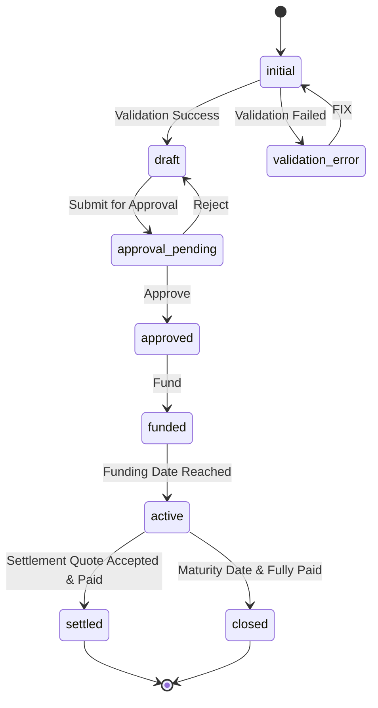

* **State Transition Table:**

This table provides the definitive logic for the Loan entity's lifecycle, serving as a direct specification for the Cyoda AI to generate the state management code.1

| Current State | Triggering Event/Condition | Action/Processor | Next State | Notes |
| :---- | :---- | :---- | :---- | :---- |
| initial | Create (Auto) | NewLoanValidationCriterion | draft | Validation succeeds, loan enters draft state. |
| initial | Create (Auto) | NewLoanValidationFailedCriterion, AttachNewLoanValidationErrorProcessor | validation\_error | Validation fails, error details attached. |
| validation\_error | FIX (Manual) | ClearValidationErrorReasonProcessor | initial | User corrects data and retries. |
| draft | SubmitForApproval (Manual) | PrepareForApproval (SYNC) | approval\_pending | Submits the draft loan for review. |
| approval\_pending | Approve (Manual, Maker/Checker) | StampedApproval (SYNC) | approved | Records actor/role metadata for audit. |
| approval\_pending | Reject (Manual) | \- | draft | Returns the loan for correction. |
| approved | Fund (Manual) | SetInitialBalances (SYNC), GenerateReferenceSchedule (ASYNC) | funded | Initializes balances and schedules. |
| funded | fundedDate \<= now() (Automated) | \- | active | Loan becomes active on its funding date. |
| active | maturityDate reached AND outstandingPrincipal \== 0 (Automated) | CloseLoan (SYNC) | closed | Loan is closed at term end if fully paid. |
| active | Accepted SettlementQuote exists and is paid (Automated) | ApplySettlement (SYNC) | settled | Loan is closed due to early settlement. |

#### **3.3.2. Party Entity**

```json
{
  "party_id": "BORR1",
  "version": 1,
  "status": "ACTIVE",
  "entity_type": "CORPORATE",
  "legal_name": "Example Borrower Ltd",
  "lei": "5493001KJTIIGC8Y1R12",
  "jurisdiction": "GB",
  "incorporation_date": "2010-05-21",
  "roles": [
    "BORROWER"
  ],
  "address": {
    "registered": {
      "street_address": "123 Business Park",
      "city": "London",
      "postal_code": "EC2N 2AX",
      "country": "GB"
    },
    "mailing": {
      "street_address": "123 Business Park",
      "city": "London",
      "postal_code": "EC2N 2AX",
      "country": "GB"
    }
  },
  "tax_details": {
    "tax_residency": "GB",
    "tax_id": "9876543210"
  },
  "audit": {
    "created_at": "2024-09-15T10:00:00Z",
    "created_by": "onboarding_specialist",
    "updated_at": "2024-09-15T10:00:00Z",
    "updated_by": "onboarding_specialist"
  }
}
```

#### **3.3.3. Accrual**

This entity records the result of the daily interest calculation for each active loan.

```json
{
  "accrual_id": "accr_a7b3c2d9-1e4f-4a8b-8f3c-5d6e7f8g9h0i",
  "loan_id": "loan_f4c3d2e1-9b8a-4d7c-8e6f-1a2b3c4d5e6f",
  "value_date": "2025-10-03",
  "status": "POSTED",
  "currency": "GBP",
  "calculation_inputs": {
    "principal_base": 950000.00,
    "effective_rate": 0.05,
    "day_count_convention": "ACT/365",
    "day_count_fraction": 0.00273973
  },
  "accrued_amount": 130.13698630,
  "sub_ledger_entries": [
    {
      "entry_id": "je_deb_a1b2c3d4",
      "account": "Interest Receivable",
      "type": "DEBIT",
      "amount": 130.13698630
    },
    {
      "entry_id": "je_cre_e5f6g7h8",
      "account": "Interest Income",
      "type": "CREDIT",
      "amount": 130.13698630
    }
  ],
  "audit": {
    "created_at": "2025-10-03T23:05:10Z",
    "created_by": "System/EOD_Processor",
    "posted_at": "2025-10-03T23:05:12Z"
  }
}
```

#### **3.3.4. Payment**

This represents a single payment received from a borrower and details how the funds were allocated to interest, fees, and principal.

```json
{
  "payment_id": "pmt_8a7b2c1d-6e4f-4b9a-9e2c-3d4f5e6a7b8c",
  "loan_id": "loan_f4c3d2e1-9b8a-4d7c-8e6f-1a2b3c4d5e6f",
  "payer_party_id": "BORR1",
  "status": "POSTED",
  "payment_amount": 50000.00,
  "currency": "GBP",
  "value_date": "2025-10-03",
  "received_date": "2025-10-02",
  "payment_method": "BANK_TRANSFER",
  "reference": "BACS-REF-XYZ-12345",
  "allocation": {
    "interest_allocated": 12540.50,
    "fees_allocated": 0.00,
    "principal_allocated": 37459.50
  },
  "sub_ledger_entries": [
    {
      "entry_id": "je_deb_c1d2e3f4",
      "account": "Cash",
      "type": "DEBIT",
      "amount": 50000.00
    },
    {
      "entry_id": "je_cre_g5h6i7j8",
      "account": "Interest Receivable",
      "type": "CREDIT",
      "amount": 12540.50
    },
    {
      "entry_id": "je_cre_k9l0m1n2",
      "account": "Loan Principal",
      "type": "CREDIT",
      "amount": 37459.50
    }
  ],
  "audit": {
    "created_at": "2025-10-02T14:30:00Z",
    "created_by": "Peter, the Payment Processor",
    "posted_at": "2025-10-02T14:32:15Z"
  }
}
```

**Finite State Machine (FSM) Diagram:**

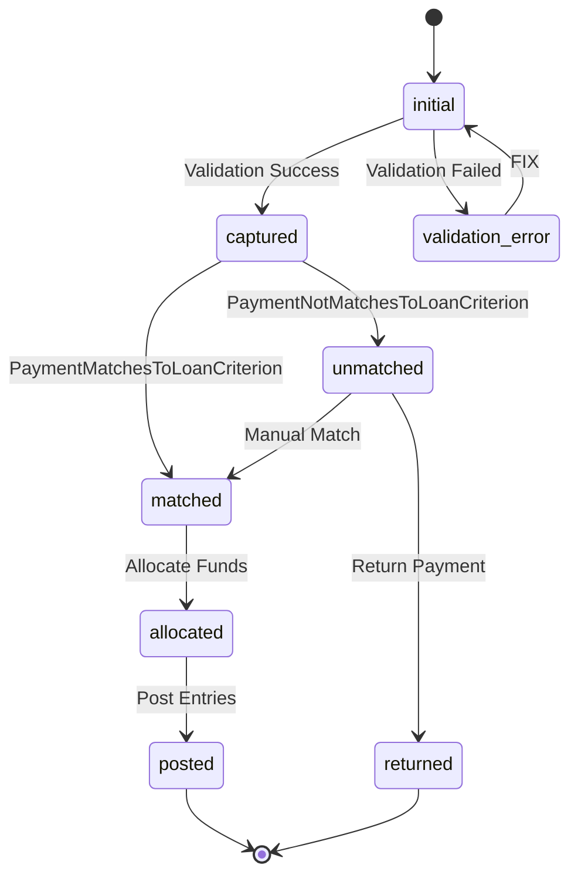

* **State Transition Table:**

| Current State | Triggering Event/Condition | Action/Processor/Criterion | Next State | Notes |
| :---- | :---- | :---- | :---- | :---- |
| initial | Create (Auto) | PaymentValidationCriterion | captured | Validation succeeds, payment is captured. |
| initial | Create (Auto) | PaymentValidationFailedCriterion, AttachPaymentValidationErrorProcessor | validation\_error | Validation fails, error details attached. |
| validation\_error | FIX (Manual) | ClearValidationErrorReasonProcessor | initial | User corrects data and retries. |
| captured | Auto | PaymentMatchesToLoanCriterion | matched | Payment successfully matches to an active loan. |
| captured | Auto | PaymentNotMatchesToLoanCriterion | unmatched | Payment cannot be matched to an active loan. |
| matched | Auto | AllocatePaymentFunds (SYNC) | allocated | Funds allocated per waterfall rules. |
| allocated | Auto | PostPaymentEntries (ASYNC\_NEW\_TX) | posted | Sub-ledger entries posted, loan balances updated. |
| unmatched | Manual Match (Manual) | ManualMatchPayment (SYNC) | matched | User manually matches payment to correct loan. |
| unmatched | Return Payment (Manual) | ReturnPayment (SYNC) | returned | Payment returned to payer. |

#### **3.3.5. GLBatch**

A batch of summarized accounting entries prepared at the end of a month for posting to the General Ledger. It includes header information, control totals, and an embedded list of GL lines as a sub-structure.

**Note**: GL lines are stored as an embedded array within the GLBatch entity, not as separate entities with their own lifecycle. Each line represents a single debit or credit entry in the batch.

```json
{
  "batch_id": "gl-batch-b3d4a1c2-9e8f-4a7b-8c6d-5e4f3a2b1c0d",
  "period": "2025-09",
  "status": "PREPARED",
  "export_format": "CSV",
  "control_totals": {
    "total_debits": 4130130.55,
    "total_credits": 4130130.55,
    "line_item_count": 4
  },
  "gl_lines": [
    {
      "gl_line_id": "gll-1a2b-3c4d",
      "gl_account": "1100-Interest-Receivable",
      "description": "Total interest accrued for period 2025-09",
      "type": "DEBIT",
      "amount": 130130.55
    },
    {
      "gl_line_id": "gll-5e6f-7g8h",
      "gl_account": "4000-Interest-Income",
      "description": "Total interest income recognized for period 2025-09",
      "type": "CREDIT",
      "amount": 130130.55
    },
    {
      "gl_line_id": "gll-9i0j-1k2l",
      "gl_account": "1010-Cash",
      "description": "Total cash received from loan payments in period 2025-09",
      "type": "DEBIT",
      "amount": 4000000.00
    },
    {
      "gl_line_id": "gll-3m4n-5o6p",
      "gl_account": "1200-Loan-Principal",
      "description": "Total loan principal reduction from payments in period 2025-09",
      "type": "CREDIT",
      "amount": 4000000.00
    }
  ],
  "audit": {
    "prepared_at": "2025-10-01T10:05:00Z",
    "prepared_by": "Fiona, the Finance Manager",
    "approvals": [],
    "exported_at": null,
    "posted_at": null
  }
}
```

**Finite State Machine (FSM) Diagram:**

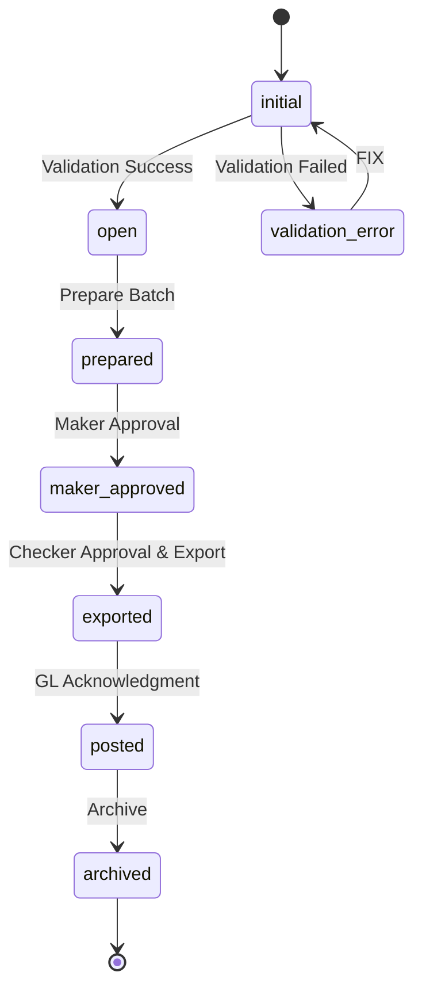

* **State Transition Table:**

| Current State | Triggering Event/Condition | Action/Processor | Next State | Notes |
| :---- | :---- | :---- | :---- | :---- |
| initial | Create (Auto) | GLBatchValidationCriterion | open | Validation succeeds, batch can be created. |
| initial | Create (Auto) | GLBatchValidationFailedCriterion, AttachGLBatchValidationErrorProcessor | validation\_error | Validation fails (e.g., period already processed). |
| validation\_error | FIX (Manual) | ClearValidationErrorReasonProcessor | initial | User corrects data and retries. |
| open | Prepare (Manual) | SummarizePeriod (ASYNC\_NEW\_TX), CalculateControlTotals (SYNC) | prepared | Aggregates sub-ledger entries for the period. |
| prepared | Approve Export \- Maker (Manual) | RecordMakerApproval (SYNC) | maker\_approved | First approver (maker) approves the batch. |
| maker\_approved | Approve Export \- Checker (Manual) | MakerCheckerDifferentUsers (criterion), RecordCheckerApproval (SYNC), GenerateExportFile (SYNC), SendToGLSystem (ASYNC\_NEW\_TX) | exported | Second approver (checker) approves and exports. |
| exported | Acknowledgment Received (Auto) | GLAcknowledgmentReceived (criterion) | posted | GL system confirms receipt of batch. |
| posted | Archive (Manual) | ArchiveBatch (SYNC) | archived | Batch is archived for retention. |

### **3.4. Processors and Event Triggers**

Processors contain the business logic executed during state transitions. Defining their triggers, execution modes, and side effects explicitly provides a precise contract for code generation, ensuring the system is not only functionally correct but also resilient and performant by clarifying transactional boundaries.1

* **ValidateNewLoan (SYNC)**
    * **Trigger:** On Loan.Create transition.
    * **Inputs:** New loan data (party ID, term, APR).
    * **Logic:** Verifies that the associated partyId exists and is active, the term is one of the allowed values {12, 24, 36}, and the APR is within a valid range.
    * **Outputs:** Throws a validation exception on failure, preventing the state transition.
* **SetInitialBalances (SYNC)**
    * **Trigger:** On Loan.Fund transition (APPROVED \-\> FUNDED).
    * **Inputs:** The Loan entity.
    * **Logic:** Sets outstandingPrincipal equal to the initial principal. Sets accruedInterest to 0\.
    * **Outputs:** Updated Loan entity. This action occurs within the same transaction as the state change.
* **ComputeDailyInterest (SYNC)**
    * **Trigger:** On Accrual.StartAccrual transition.
    * **Inputs:** Loan's outstandingPrincipal (as of prior day), APR, and day-count basis.
    * **Logic:** Performs the interest calculation as defined in Section 2.3.
    * **Outputs:** A precise interest amount (8 decimal places), stored on the Accrual entity.
* **SummarizePeriod (ASYNC\_NEW\_TX)**
    * **Trigger:** On GLBatch.Prepare transition (OPEN \-\> PREPARED).
    * **Inputs:** The period (e.g., "2023-10").
    * **Logic:** Queries all sub-ledger entries (from Accruals and Payments) for the given period. Groups and aggregates them by GL account, product, and cost center. Calculates control totals.
    * **Outputs:** Populates the entries and controlTotals fields of the GLBatch entity. Runs in a separate transaction to handle potentially long-running queries without blocking the user.


### **3.4. Criteria & Processors — Default Handling Additions**

**Criteria**
- `IsOverdueBeyondGrace(loan, instalment, graceDays)` → bool
- `CureEvidenceAccepted(eodEvent)` → bool (checker)
- `CaseConfirmable(defaultCase)` → bool (now > cureDeadline and breach persists)

**Processors**
- `OpenDefaultCase(loan, eodEvent)` (SYNC): create case, set `controllingEventId`, derive `cureDeadline`.
- `ApplyDefaultPolicy(defaultCase)` (SYNC):
    - If DEFAULT_RATE: set `aprDefault = apr + defaultMarginBps`; schedule accrual to Default Interest Income.
    - If NON_ACCRUAL: halt income recognition; enable memo accrual.
- `ComputeAcceleratedBalance(loan, defaultCase, accelDate)` (SYNC): compute payoff; attach `SettlementQuote`.
- `FreezeScheduleOnAcceleration(loan)` (SYNC): block future instalment generation.
- `RecordCure(defaultCase, eodEvent)` (SYNC): set `CURED`; revert to standard APR going forward; re‑enable normal accrual.
- `CloseCase(defaultCase)` (SYNC): terminal transition; snapshot outcomes & audit.


### **3.5. Data Examples (Default Handling)**

**EoDEvent (Non‑Payment, scheduled detection)**

```json
{
  "eodEventId": "EOD-000123",
  "loanId": "LOAN-2025-001",
  "type": "NON_PAYMENT",
  "raisedAt": "2025-10-05T00:05:00Z",
  "source": "SYSTEM",
  "graceDays": 3,
  "cureDays": 7,
  "status": "IN_CURE",
  "evidence": [
    {"note": "Instalment due 2025-10-01 unpaid as of 2025-10-05"}
  ],
  "audit": {"createdBy": "Scheduler", "createdAt": "2025-10-05T00:05:00Z"}
}
```

**DefaultCase (Confirmed & Accelerated)**

```json
{
  "defaultCaseId": "DC-000045",
  "loanId": "LOAN-2025-001",
  "state": "ACCELERATED",
  "controllingEventId": "EOD-000123",
  "policy": "DEFAULT_RATE",
  "defaultMarginBps": 250,
  "cureDeadline": "2025-10-12T23:59:59Z",
  "acceleration": {
    "accelDate": "2025-10-13",
    "acceleratedAmount": 514320.75,
    "quoteId": "SQ-ACCEL-0009"
  },
  "timeline": [
    {"at": "2025-10-12T23:59:59Z", "action": "Cure window lapsed"},
    {"at": "2025-10-13T09:00:00Z", "action": "Default confirmed (checker)"},
    {"at": "2025-10-13T09:05:00Z", "action": "Acceleration computed"}
  ],
  "audit": {
    "maker": "loan_admin_1",
    "checker": "finance_mgr_2",
    "createdAt": "2025-10-05T00:05:00Z",
    "updatedAt": "2025-10-13T09:05:00Z"
  }
}
```


## **Part 4: Non-Functional Requirements (NFRs)**

While functional requirements define what the system does, non-functional requirements (NFRs) define how well it does it. These requirements specify the quality attributes, operational constraints, and standards that are essential for an enterprise-grade application. Including explicit, measurable NFRs elevates the specification from a feature list to a blueprint for a production-ready system, demonstrating a mature understanding of real-world operational needs.11

### **4.1. Performance & Scalability**

Performance and scalability requirements ensure the system is responsive under expected loads and can grow with the business.13

* **Response Time:** 95% of all API requests for reading data (e.g., GET /loans/{id}) shall be completed and a response returned to the client in under 500 milliseconds under normal load conditions.15
* **Batch Processing:** The daily interest accrual batch job for a portfolio of 10,000 active loans must complete in under 15 minutes.
* **Concurrent Users:** The system must support up to 100 concurrent internal users performing standard operations without performance degradation.
* **Scalability:** The system architecture must be capable of handling a 20% year-over-year growth in the number of active loans for the next 5 years without requiring a major architectural redesign.

### **4.2. Availability & Reliability**

Availability and reliability requirements define the system's uptime and its ability to withstand and recover from failures.11

* **Availability:** The system shall achieve an uptime of 99.95%, measured on a quarterly basis. This calculation excludes scheduled maintenance windows, which will be limited to 4 hours per month and communicated 7 days in advance.
* **Reliability:** The system must operate without critical failures for 99% of the time during business hours.14 A critical failure is defined as an event that prevents users from performing core business functions (e.g., creating loans, processing payments).
* **Resilience & Error Handling:**
    * **Idempotency:** All state-changing API endpoints (POST, PUT, DELETE) must be idempotent where applicable to prevent duplicate operations on network retries.
    * **Graceful Degradation:** In the event the downstream GL system is unavailable, the GL batch export function should be disabled in the UI with a clear status message. The system must continue to perform all other core functions.
    * **Automated Retries:** Failed attempts to send the GL batch file to the downstream system shall be automatically retried using an exponential back-off algorithm (e.g., retry after 1 min, 5 min, 15 min) for up to 4 hours before requiring manual intervention.17

### **4.3. Security & Compliance**

Security and compliance are paramount for a financial system. These requirements define the measures to protect data integrity, control access, and meet regulatory obligations.13

* **Authentication:** All access to the system's UI and API must be authenticated. The API must be secured using the OAuth 2.0 protocol.
* **Authorization:** The system must implement Role-Based Access Control (RBAC). User actions shall be restricted based on their assigned role (Loan Administrator, Payment Processor, Finance Manager). For example, only users in the Finance Manager role can approve a GL batch export.
* **Audit Trail:** Every state change to a financial entity (Loan, Payment, GLBatch) and any change to their core financial attributes must be recorded in an immutable audit log. The log must capture the user who made the change, the timestamp, and the before/after values.
* **Data Encryption:** All data must be encrypted in transit using TLS 1.2 or higher. Sensitive data at rest in the database should be encrypted.
* **Compliance & Data Retention:** The system must retain all audit logs and archived GLBatch records for a minimum of 7 years to comply with financial regulations.

### **4.4. Maintainability & Usability**

These requirements ensure the system is efficient to manage over its lifetime and provides a positive experience for its users.11

* **Maintainability:**
    * **Code Quality:** All system code must adhere to defined coding standards and conventions.
    * **Test Coverage:** The back-end logic must achieve a minimum of 80% unit test coverage to facilitate safe refactoring and future enhancements.
    * **Logging:** The system must produce structured logs (e.g., JSON format) for all significant events, errors, and transactions to aid in troubleshooting and monitoring.
* **Usability:**
    * **Learnability:** A new user with domain knowledge should be able to complete core tasks (e.g., creating a loan, recording a payment) without formal training after a 15-minute guided orientation.
    * **Error Prevention:** The UI must provide real-time validation on all input forms to prevent users from entering incorrectly formatted data (e.g., non-numeric characters in an amount field). Critical actions (e.g., exporting a GL batch) must require a confirmation dialog before proceeding.
    * **Consistency:** The UI design, including layout, terminology, and interaction patterns, must be consistent across the entire application.15


### **4.5. Non‑Functional & Controls — EoD‑Specific**

- **Auditability:** All EoD transitions (raise, confirm, cure, accelerate, close) must be recorded with actor, timestamp, before/after state, and policy parameters.
- **Idempotency:** Replays of *Confirm Default* and *Accelerate* must be idempotent (no duplicate quotes, no duplicate policy application).
- **Access Control:** Only **checker** role can confirm default or accelerate.
- **Observability:** Correlate EoD processors with loan id and defaultCaseId; provide dashboards for case aging and cure rates.

## **Part 5: Interface Specifications**

This section provides detailed specifications for the system's primary interfaces: the user interface for internal staff and the REST API for programmatic interaction. These specifications are designed to be self-contained, actionable guides for the development teams responsible for their implementation.

### **5.1. User Interface (UI) & User Experience (UX) Guide (for Lovable.dev)**

This guide provides the design philosophy, visual language, and component-level specifications for the Lovable.dev team to build a consistent, professional, and highly usable front-end application. The backend is built on the Cyoda platform, and all business logic is implemented on the server side. The UI's role is to provide an efficient and clear interface to this logic via the API specified in Section 5.2. The data models are fixed and should not be altered by the UI implementation.1

#### **5.1.1. Design Philosophy**

* **Corporate yet Modern:** The aesthetic should be professional, precise, and trustworthy. The design must inspire confidence through clarity and order. This is achieved with clean grid layouts, a controlled color palette, and a focus on function over ornamentation.1
* **High-Density Information:** The target users are expert operational staff who require access to large amounts of data. The design should prioritize information density through compact typography, reduced padding/margins, and well-structured data grouping. Dashboards and tables must be able to display many rows and columns without feeling cramped or sacrificing legibility.1
* **Minimalist Interaction:** Interactions should be clear and efficient. The design should use subtle hover states, clear but minimal iconography, and restrained animations. The goal is to reduce cognitive load, not to create a flashy experience.1

#### **5.1.2. Visual Language**

* **Typography:**
    * **Primary Font:** Inter or IBM Plex Sans. Both are chosen for their high legibility at small sizes, which is crucial for a data-dense interface.1
    * **Font Sizing:**
        * Headers: 14–16px (bold). Avoid oversized titles.
        * Body/Data Cells: 12–13px.
        * Labels/Metadata: 10–11px (lighter weight or color).
    * **Line Height:** Tight line-height () to support information density.1
* **Color Scheme (Light Theme):** A high-contrast, low-glare palette optimized for long periods of use.1
    * **Backgrounds:** Primary: \#FFFFFF, Secondary Panels: \#F5F6F7.
    * **Text:** Primary: \#1D1F23 (Charcoal), Secondary/Labels: \#5C6066 (Mid-gray).
    * **Accents (Restrained Use):**
        * Action Blue: \#2A7DE1 (buttons, links, focus states).
        * Emerald Green: \#27AE60 (success, positive status like APPROVED).
        * Amber Orange: \#F5A623 (warnings, pending status like APPROVAL\_PENDING).
        * Crimson Red: \#D64541 (errors, critical status like REJECTED).
    * **Borders & Dividers:** \#E0E3E6 (Neutral Divider Lines).

#### **5.1.3. Component Library Specification**

This section details the required states and behaviors for key UI components, providing a clear contract for their implementation.18

* **Tables:**
    * **Structure:** Dense row height (approx. 40px). Must support column sorting and filtering.
    * **Styling:** Zebra-striping (\#FAFBFC and \#FFFFFF). Thin borders (\#E0E3E6).
    * **States:**
        * **Hover:** Row background changes to a light gray (\#F2F4F6).
        * **Selected:** Row has a persistent blue background or left border.
* **Forms & Inputs:**
    * **Structure:** Labels should be placed above the input fields. Real-time validation feedback should appear below the input.
    * **Styling:** Input borders: \#CED1D6.
    * **States:**
        * **Default:** Standard border.
        * **Focus:** Border color changes to Action Blue (\#2A7DE1) with a subtle outer glow.
        * **Disabled:** Background is light gray (\#F5F6F7), text is \#9CA0A6.
        * **Error:** Border color changes to Crimson Red (\#D64541), and an error message is displayed below.
* **Buttons:**
    * **Types:** Primary (solid Action Blue), Secondary (white background, blue border), Tertiary (text only).
    * **States:**
        * **Default:** Standard appearance.
        * **Hover:** Slightly darker shade for primary, light blue background for secondary/tertiary.
        * **Active/Pressed:** Darker shade and/or inset shadow.
        * **Disabled:** Grayed out, non-interactive cursor.

#### **5.1.4. Accessibility**

The application must be accessible to users with disabilities.

* **Compliance:** The UI must adhere to Web Content Accessibility Guidelines (WCAG) 2.1 Level AA standards.15
* **Keyboard Navigation:** All interactive elements (inputs, buttons, links, table rows) must be navigable and operable using only a keyboard. Focus indicators must be clearly visible.18
* **Screen Reader Support:** All elements must use semantic HTML and ARIA attributes where necessary to ensure they are correctly interpreted by screen readers. All images and icons must have descriptive alt text.18
* **Color Contrast:** Text and background color combinations must meet WCAG AA contrast ratio requirements.

### **5.1.5. UI Additions — Default Handling**

- **Loan Detail EoD Banner:** shows current case state (IN_CURE, CONFIRMED, ACCELERATED).
- **EoD Tab:** timeline of EoD events, cure history, approvals, generated quotes.
- **Actions (role‑gated):** *Raise EoD*, *Confirm Default*, *Record Cure*, *Accelerate*, *Close Case*.
- **Validation/Guardrails:** Maker/Checker enforced on confirm and accelerate; irreversible actions require explicit confirmation dialog.


### **5.2. API Specification (OpenAPI v3.0 Format)**

This section defines the formal contract for the RESTful API that the back-end system will expose. The API is the primary interface for the UI and any other future system integrations. Adhering to a formal specification like OpenAPI v3.0 and REST best practices ensures clarity, enables auto-generation of client code and documentation, and allows for parallel development of the front-end and back-end.20

An OpenAPI specification file will be generated by the Cyoda AI and provided as a separate artifact. The UI team should use the link to this specification to connect to the REST endpoints for all CRUD actions.1 The following provides a summary and key design principles.

#### **5.2.1. General Principles**

* **Data Format:** The API will exclusively accept and respond with JSON (application/json).20
* **Authentication:** All endpoints are protected and require a valid OAuth 2.0 Bearer Token to be passed in the Authorization header.
* **Naming Conventions:**
    * Resource URIs use plural nouns (e.g., /loans, /payments).22
    * URIs are lowercase and use hyphens to separate words if necessary.23
    * Field names in JSON payloads use camelCase.
* **HTTP Methods:** Standard HTTP methods are used to represent CRUD operations:
    * GET: Retrieve resources.
    * POST: Create new resources.
    * PUT: Update existing resources (full replacement).
    * DELETE: Remove resources.
* **Error Handling:** Errors are handled gracefully using standard HTTP status codes. Error responses will contain a consistent JSON body: { "errorCode": "string", "message": "string" }.20
    * 400 Bad Request: Client-side validation error.
    * 401 Unauthorized: Missing or invalid authentication token.
    * 403 Forbidden: Authenticated user does not have permission for the action.
    * 404 Not Found: The requested resource does not exist.
    * 500 Internal Server Error: A generic server-side error.

#### **5.2.2. API Endpoint Summary**

The following table provides a high-level overview of the key API endpoints for the MVP.

| Feature | HTTP Method | URI Path | Description | Required Role |
| :---- | :---- | :---- | :---- | :---- |
| **Loans** |  |  |  |  |
| List all loans | GET | /loans | Retrieves a paginated list of all loans. Supports filtering by status. | Loan Administrator |
| Create a new loan | POST | /loans | Creates a new loan record. The initial state will be DRAFT. | Loan Administrator |
| Get loan details | GET | /loans/{loanId} | Retrieves the full details for a specific loan. | Loan Administrator |
| Update loan state | PUT | /loans/{loanId}/state | Transitions a loan to a new state (e.g., approve, fund). The request body specifies the target state and any required parameters. | Loan Administrator, Finance Manager |
| **Payments** |  |  |  |  |
| List payments for a loan | GET | /loans/{loanId}/payments | Retrieves a list of all payments associated with a specific loan. | Payment Processor |
| Record a new payment | POST | /loans/{loanId}/payments | Records a new payment against a specific loan. | Payment Processor |
| **GL Batches** |  |  |  |  |
| Get GL batch details | GET | /gl-batches/{batchId} | Retrieves the details of a specific GL batch, including its summary lines. | Finance Manager |
| Prepare a GL batch | POST | /gl-batches?period=YYYY-MM | Initiates the process to prepare the GL batch for a given period. | Finance Manager |
| Export a GL batch | GET | /gl-batches/{batchId}/export | Retrieves the export file (CSV/JSON) for a prepared and approved batch. | Finance Manager |

### **5.2.3. API Endpoints — Default Handling**

| Feature | Method | URI | Description | Role |
|---|---|---|---|---|
| List EoD events | GET | `/loans/{loanId}/defaults/events` | Paginated list of EoD events for a loan | Risk/Collections |
| Raise EoD | POST | `/loans/{loanId}/defaults/events` | Create EoD event (manual) with type, evidence, cureDays | Loan Admin |
| Confirm EoD | POST | `/defaults/cases/{caseId}:confirm` | Checker‑only; applies policy | Finance Manager |
| Record Cure | POST | `/defaults/cases/{caseId}:cure` | Attach cure evidence; checker approval | Loan Admin/FM |
| Accelerate | POST | `/defaults/cases/{caseId}:accelerate` | Compute accelerated payoff & freeze schedule | Finance Manager |
| Close Case | POST | `/defaults/cases/{caseId}:close` | Close after cure/waiver/payoff | Risk/Collections |

## **User Stories**

Of course. Based on the provided specification, here are new and expanded user stories for the system administrators to cover functionality that was mentioned but not detailed in user story format.

These stories are grouped by epic and follow the structure used in the document (As a..., I want to..., So that...) with specific acceptance criteria.

### **Epic: Party Management**

This new epic covers the essential but previously undefined functionality of managing borrower entities (Parties) before they can be associated with a loan.

**User Story: Create a New Party**

* **As a** Clare, the Loan Administrator,
* **I want to** create a new Party record by entering its legal name, jurisdiction, and other key identifiers 1111.
* **So that** the Party is available in the system to be associated with a new loan agreement.
* **Acceptance Criteria:**
    * **Given** I am a Loan Administrator, **when** I navigate to the "Parties" section and click "Create New Party", **and** I enter a valid Legal Name and Jurisdiction, **then** the system shall create a new Party entity in the ACTIVE state2.
    * **Given** I am creating a new Party, **when** I attempt to save without providing a Legal Name, **then** the system shall display a validation error and prevent the Party from being created.

**User Story: View and Search for Parties**

* **As a** Clare, the Loan Administrator,
* **I want to** view a list of all existing Parties and search for a specific Party by name.
* **So that** I can verify if a borrower already exists before creating a duplicate record or selecting one for a new loan.
* **Acceptance Criteria:**
    * **Given** I am a Loan Administrator, **when** I navigate to the "Parties" section, **then** I shall see a table listing all existing Parties with columns for Legal Name, LEI, and Jurisdiction3.
    * **Given** I am viewing the Party list, **when** I type a name into the search bar, **then** the list shall filter in real-time to show only Parties whose names match the search term.

---

### **Epic: Loan Lifecycle Management**

These stories add detail to the core loan management process, including the main dashboard and the early settlement feature.

**User Story: View Loan Dashboard**

* **As a** Clare, the Loan Administrator,
* **I want to** see a dashboard listing all loans in the system.
* **So that** I can get a high-level overview of the loan portfolio and quickly navigate to a specific loan.
* **Acceptance Criteria:**
    * **Given** I am logged in, **when** I navigate to the main dashboard, **then** I shall see a paginated table of all loans.
    * **Given** I am viewing the loan dashboard, **then** the table shall include columns for Loan ID, Party Name, Principal, APR, Status (e.g., APPROVAL\_PENDING, ACTIVE), and Maturity Date.
    * **Given** I am viewing the loan dashboard, **when** I use the filter controls, **then** I can filter the list of loans by their current State (e.g., show only ACTIVE loans).

**User Story: Generate an Early Settlement Quote**

* **As a** Clare, the Loan Administrator,
* **I want to** generate an early settlement quote for an active loan for a future date4.
* **So that** I can provide the borrower with the exact amount required to close their loan ahead of schedule.
* **Acceptance Criteria:**
    * **Given** a loan is in the ACTIVE state, **when** I select the "Generate Settlement Quote" action and provide a future settlement date, **then** the system shall calculate the total amount due, comprising the outstandingPrincipal plus all accruedInterest up to and including the specified settlement date.
    * **Given** a quote has been calculated, **then** the system shall create a SettlementQuote entity with a QUOTED status, the total amount due, and an expiration date5.

---

### **Epic: Payment Processing**

This story addresses the specific scenario of a borrower overpaying their loan.

**User Story: Process a Borrower Overpayment**

* **As a** Peter, the Payment Processor,
* **I want to** enter a payment that is greater than the total amount outstanding on a loan.
* **So that** the system correctly allocates the necessary funds to close the loan and flags the excess amount for reconciliation.
* **Acceptance Criteria:**
    * **Given** I am recording a payment against an ACTIVE loan, **when** the payment amount is greater than the sum of accruedInterest and outstandingPrincipal, **then** the system shall apply funds according to the allocation waterfall to bring both balances to zero6.
    * **Given** the loan balances have been reduced to zero, **then** the system shall flag the remaining unallocated portion of the payment as "Excess Funds" for manual review by the finance team.
    * **Given** the overpayment has been fully allocated and flagged, **then** the system shall automatically transition the loan's state to SETTLED7.

---

### **Epic: Financial Calculations & Reporting**

These stories provide users with the ability to view and verify the system's automated calculations.

**User Story: View Interest Accrual History**

* **As a** Fiona, the Finance Manager,
* **I want to** view a complete history of daily interest accruals for a specific loan.
* **So that** I can audit the interest calculation and answer detailed queries about the loan's interest balance.
* **Acceptance Criteria:**
    * **Given** I am viewing an ACTIVE loan, **when** I navigate to the "Accrual History" tab, **then** I shall see a table listing every daily Accrual record generated for that loan8.
    * **Given** I am viewing the accrual history, **then** the table shall include columns for Value Date, Principal Base, Accrued Amount, and Status (e.g., POSTED)999999999.

**User Story: Review GL Batch Details for Approval**

* **As a** Fiona, the Finance Manager,
* **I want to** review the detailed, aggregated journal lines within a prepared GL Batch before approving it for export10101010.
* **So that** I can verify the accuracy of the financial summaries and ensure the batch is balanced before it is sent to the General Ledger.
* **Acceptance Criteria:**
    * **Given** a GLBatch is in the PREPARED state 11,
    * **when** I open its detailed view, **then** I shall see the full list of aggregated GL lines with their respective debit/credit amounts12.
    * **Given** I am viewing the GL Batch details, **then** I can see the control totals for total debits and credits and confirm they are equal13131313.
    * **Given** I have verified the batch details are correct, **when** I click "Approve", **then** my approval is recorded, and the system is ready for the second "checker" approval before enabling the export action.

## **Conclusions**

This specification provides a comprehensive, multi-faceted blueprint for the Commercial Loan Management System. By structuring the document to address its distinct audiences—potential customers, the Cyoda AI generator, and the Lovable.dev UI team—it moves beyond a simple technical document to become a strategic asset for demonstration, development, and integration.

The key structural and content enhancements introduced are:

1. **Business-Centric Framing:** The document begins by establishing the business purpose, value, and scope, making it immediately accessible and relevant to non-technical stakeholders.
2. **User-Centric Requirements:** The adoption of Epics, User Stories, and Personas grounds every functional requirement in a clear user need and benefit, ensuring the final product is fit for purpose. The inclusion of testable acceptance criteria links the specification directly to the quality assurance process.
3. **Formal, Unambiguous Models:** The use of industry-standard notations like ERDs, FSM diagrams, and BPMN provides a precise and unambiguous language for technical implementation. This is particularly critical for the Cyoda AI, which requires formal models to generate reliable, enterprise-grade code.
4. **Explicit Non-Functional Requirements:** The definition of measurable NFRs for performance, availability, security, and maintainability elevates the system from a functional prototype to a production-ready enterprise application.
5. **Clear Interface Contracts:** The detailed UI Component Guide and the formal OpenAPI specification for the REST API serve as definitive contracts for the front-end and integration teams. This decouples development efforts, reduces ambiguity, and accelerates the overall delivery timeline.

By integrating these best practices, this specification is designed to mitigate common project risks such as scope creep, ambiguous requirements, and integration friction. It provides a solid foundation for building a robust, reliable, and user-friendly Loan Management System that meets the complex demands of the commercial finance domain.

#### **Works cited**

1. Loan Management System Specification.rtf
2. How to Write a Software Requirements Specification (SRS) Document, accessed on October 3, 2025, [https://www.perforce.com/blog/alm/how-write-software-requirements-specification-srs-document](https://www.perforce.com/blog/alm/how-write-software-requirements-specification-srs-document)
3. How to write a proper, plain requirements documentation for feature/product development? : r/ProductManagement \- Reddit, accessed on October 3, 2025, [https://www.reddit.com/r/ProductManagement/comments/16isvyp/how\_to\_write\_a\_proper\_plain\_requirements/](https://www.reddit.com/r/ProductManagement/comments/16isvyp/how_to_write_a_proper_plain_requirements/)
4. 10 Tips for Writing Good User Stories \- Roman Pichler, accessed on October 3, 2025, [https://www.romanpichler.com/blog/10-tips-writing-good-user-stories/](https://www.romanpichler.com/blog/10-tips-writing-good-user-stories/)
5. How to Write a Software Specifications Document (SSD) – Step-by-Step Guide, accessed on October 3, 2025, [https://www.instructionalsolutions.com/blog/how-to-write-a-software-specifications-document](https://www.instructionalsolutions.com/blog/how-to-write-a-software-specifications-document)
6. Writing Effective User Stories | User Story Tutorial \- Business Analysis Blog \- Techcanvass, accessed on October 3, 2025, [https://businessanalyst.techcanvass.com/writing-effective-user-stories/](https://businessanalyst.techcanvass.com/writing-effective-user-stories/)
7. 10 Best Practices in Writing Requirements, accessed on October 3, 2025, [https://archives.obm.ohio.gov/Files/Major\_Project\_Governance/Resources/Resources\_and\_Templates/04\_Plan/37\_Requirements\_10\_Best\_Practices.pdf](https://archives.obm.ohio.gov/Files/Major_Project_Governance/Resources/Resources_and_Templates/04_Plan/37_Requirements_10_Best_Practices.pdf)
8. User Stories and User Story Examples by Mike Cohn \- Mountain Goat Software, accessed on October 3, 2025, [https://www.mountaingoatsoftware.com/agile/user-stories](https://www.mountaingoatsoftware.com/agile/user-stories)
9. TDD: Writing Testable Code | by Eric Elliott | JavaScript Scene \- Medium, accessed on October 3, 2025, [https://medium.com/javascript-scene/tdd-writing-testable-code-30ac7a3bf49c](https://medium.com/javascript-scene/tdd-writing-testable-code-30ac7a3bf49c)
10. What are the best practices for designing an ERD? \- TutorChase, accessed on October 3, 2025, [https://www.tutorchase.com/answers/a-level/computer-science/what-are-the-best-practices-for-designing-an-erd](https://www.tutorchase.com/answers/a-level/computer-science/what-are-the-best-practices-for-designing-an-erd)
11. Nonfunctional Requirements: Examples, Types and Approaches \- AltexSoft, accessed on October 3, 2025, [https://www.altexsoft.com/blog/non-functional-requirements/](https://www.altexsoft.com/blog/non-functional-requirements/)
12. Non-functional Requirements as User Stories \- Mountain Goat Software, accessed on October 3, 2025, [https://www.mountaingoatsoftware.com/blog/non-functional-requirements-as-user-stories](https://www.mountaingoatsoftware.com/blog/non-functional-requirements-as-user-stories)
13. The Guide to Writing Software Requirements Specification \- 8allocate, accessed on October 3, 2025, [https://8allocate.com/blog/the-ultimate-guide-to-writing-software-requirements-specification/](https://8allocate.com/blog/the-ultimate-guide-to-writing-software-requirements-specification/)
14. Non-Functional Requirements Examples: a Full Guide \- Testomat.io, accessed on October 3, 2025, [https://testomat.io/blog/non-functional-requirements-examples-definition-complete-guide/](https://testomat.io/blog/non-functional-requirements-examples-definition-complete-guide/)
15. Architecture 101: Top 10 Non-Functional Requirements (NFRs) you Should be Aware of, accessed on October 3, 2025, [https://anjireddy-kata.medium.com/architecture-101-top-10-non-functional-requirements-nfrs-you-should-be-aware-of-c6e874bd57e0](https://anjireddy-kata.medium.com/architecture-101-top-10-non-functional-requirements-nfrs-you-should-be-aware-of-c6e874bd57e0)
16. Building Resilient Software: Strategies for Handling Failures and Downtime \- eTraverse, accessed on October 3, 2025, [https://etraverse.com/blog/building-resilient-software-strategies-for-handling-failures-and-downtime/](https://etraverse.com/blog/building-resilient-software-strategies-for-handling-failures-and-downtime/)
17. System Resilience Part 5: Commonly-Used System Resilience Techniques, accessed on October 3, 2025, [https://www.sei.cmu.edu/blog/system-resilience-part-5-commonly-used-system-resilience-techniques/](https://www.sei.cmu.edu/blog/system-resilience-part-5-commonly-used-system-resilience-techniques/)
18. 7 Front-End Development Best Practices for a Seamless User Experience \- Intelivita, accessed on October 3, 2025, [https://www.intelivita.com/blog/front-end-development-best-practices/](https://www.intelivita.com/blog/front-end-development-best-practices/)
19. Front End Development Best Practices and Trends (Part I) \- DOOR3, accessed on October 3, 2025, [https://www.door3.com/blog/front-end-development-trends-and-best-practices-part-i-from-design-to-mobile-integration](https://www.door3.com/blog/front-end-development-trends-and-best-practices-part-i-from-design-to-mobile-integration)
20. Best practices for REST API design \- The Stack Overflow Blog, accessed on October 3, 2025, [https://stackoverflow.blog/2020/03/02/best-practices-for-rest-api-design/](https://stackoverflow.blog/2020/03/02/best-practices-for-rest-api-design/)
21. How to Write API Documentation: a Best Practices Guide \- Stoplight, accessed on October 3, 2025, [https://stoplight.io/api-documentation-guide](https://stoplight.io/api-documentation-guide)
22. Web API Design Best Practices \- Azure Architecture Center | Microsoft Learn, accessed on October 3, 2025, [https://learn.microsoft.com/en-us/azure/architecture/best-practices/api-design](https://learn.microsoft.com/en-us/azure/architecture/best-practices/api-design)
23. REST API Best Practices, accessed on October 3, 2025, [https://restfulapi.net/rest-api-best-practices/](https://restfulapi.net/rest-api-best-practices/)